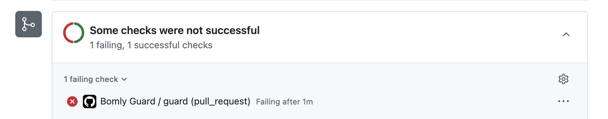
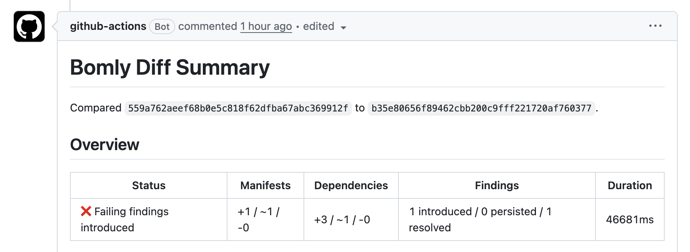
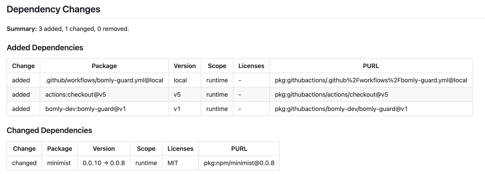
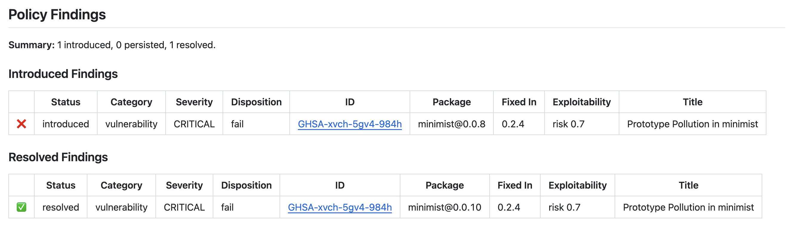

<p align="center">
  
</p>

<p align="center">
  <strong>Review Dependency Drift Before It Lands.</strong>
</p>

<p align="center">
  <a href="https://github.com/bomly-dev/bomly-guard/actions/workflows/ci.yml"></a>
  <a href="https://scorecard.dev/viewer/?uri=github.com/bomly-dev/bomly-guard"></a>
  <a href="https://github.com/bomly-dev/bomly-guard/releases/latest"></a>
  <a href="LICENSE"></a>
</p>

`bomly-guard` installs the Bomly CLI and runs `bomly diff` for pull requests, merge queues, or explicitly supplied refs.

The action is a composite wrapper around the CLI. Dependency analysis and Markdown summary rendering come from `bomly diff`; the action handles GitHub Actions plumbing such as CLI installation, PR merge-base inference, outputs, job summaries, optional pull request comments, and optional SARIF upload.

## Usage

```yaml
name: Bomly Guard

# Run Bomly Guard when someone opens or updates a pull request.
on:
  pull_request:

permissions:
  # Read workflow metadata before trying to upload SARIF results.
  actions: read
  # Read repository contents so Bomly can compare dependency files.
  contents: read
  # Needed only when comment-summary-in-pr is always or on-failure.
  pull-requests: write
  # Lets the action update an existing PR comment through the Issues API.
  issues: write
  # Needed only when upload-sarif is true or auto and code scanning is available.
  security-events: write

jobs:
  dependency-review:
    runs-on: ubuntu-latest
    steps:
      - uses: actions/checkout@v5
        with:
          # Bomly compares two git refs, so it needs enough history to find
          # the PR merge base instead of only seeing the latest commit.
          fetch-depth: 0
      - uses: bomly-dev/bomly-guard@v1
        with:
          # Fail the job when the PR introduces high-risk findings.
          fail-on: high
          # Leave a PR comment only when the dependency review finds something.
          comment-summary-in-pr: on-failure
```

On pull requests, the action compares the PR head against the PR merge base unless `base-ref` is set. This keeps review focused on dependency changes introduced by the PR instead of changes already present on the target branch.

For Marketplace and CI stability, pin to a major tag such as `@v1` or to an exact release tag such as `@v1.2.3`.

Bomly Guard downloads the public Bomly CLI release without a token by default. If your workflow hits GitHub public rate limits while resolving or downloading the CLI release, pass an optional token:

```yaml
- uses: bomly-dev/bomly-guard@v1
  with:
    cli-token: ${{ github.token }}
```

## Viewing Results

Bomly Guard writes the same review summary in a few places so teams can choose the workflow that fits them:

- The GitHub Actions job summary shows the dependency review table after each run.
- The pull request checks panel shows whether policy findings block the PR.
- Pull request comments can be enabled with `comment-summary-in-pr`.
- SARIF upload can send supported findings to GitHub code scanning.
- JSON outputs are available for follow-up jobs that need to inspect the dependency diff.

**Pull request check result**



Bomly Guard reports the policy result as a normal GitHub check, so teams can make dependency policy part of branch protection.

**Pull request comment summary**



When `comment-summary-in-pr` is enabled, reviewers can see the dependency review without opening the Actions run.

**Dependency changes**



The dependency table separates added, changed, and removed packages, then includes package URLs so each change is traceable.

**Policy findings**



Policy findings distinguish new issues from resolved ones, which helps reviewers focus on what the pull request actually introduced.

## Inputs

| Input | Default | Description |
| --- | --- | --- |
| `version` | `latest` | Bomly CLI release to install, such as `latest`, `v0.4.6`, or `0.4.6`. |
| `cli-token` | | Optional token for Bomly CLI release API and download requests, useful if public GitHub rate limits are hit. |
| `repo-token` | `${{ github.token }}` | Token for current-repository API access, pull request comments, and repository security checks. |
| `log-level` | `verbose` | Bomly CLI log level: `quiet`, `verbose`, or `debug`. |
| `base-ref` | inferred | Base git ref to compare. Pull requests use the PR merge base when this is not set. |
| `head-ref` | inferred | Head git ref to compare. Pull requests use the PR head SHA when this is not set. |
| `config-file` | | Local Bomly config path or `owner/repo/path@ref` external config reference. |
| `external-repo-token` | `repo-token` | Token for private external config repositories. |
| `enrich` | `true` | Look up additional package metadata, such as vulnerability and license details, before evaluating policy. |
| `audit` | `true` | Evaluate vulnerability and policy findings. SARIF output is generated only when audit is enabled. |
| `analyze` | `false` | Run reachability analysis for supported ecosystems so findings can include whether vulnerable code appears reachable. |
| `fail-on` | | Comma-separated finding severities or policy categories that should fail the job. |
| `allow-licenses` | | Comma-separated SPDX license IDs that are allowed by policy. |
| `deny-licenses` | | Comma-separated SPDX license IDs that should be blocked by policy. |
| `license-exempt-packages` | | Comma-separated package URLs that should be ignored by license policy. |
| `allow-vulnerability-ids` | | Comma-separated vulnerability IDs that should not fail the review. |
| `deny-packages` | | Comma-separated package URLs that should be blocked when introduced or changed. |
| `deny-groups` | | Comma-separated package URL namespaces, such as a package scope or group, that should be blocked. |
| `protected-packages` | | Comma-separated package names Bomly should watch for typosquatting lookalikes. |
| `typosquat-threshold` | | Similarity threshold for suspicious package-name matches. Lower values are stricter. |
| `typosquat-mode` | | How typosquatting findings affect the run: `warn` reports them, and `fail` blocks the job. |
| `warn-only` | `false` | Report failing findings as warnings without failing the GitHub Actions job. |
| `ecosystems` | | Limit dependency detection to selected ecosystems. Leave empty to let Bomly detect supported ecosystems automatically. |
| `detectors` | | Limit which dependency-file detectors run. Useful for advanced workflows that need only specific lockfile or manifest detectors. |
| `matchers` | | Limit which dependency matchers run when Bomly compares packages across the base and head refs. |
| `auditors` | | Limit which policy or vulnerability auditors run during review. |
| `analyzers` | | Limit which reachability analyzers run when `analyze` is enabled. |
| `install-first` | `false` | Run detector-specific dependency installation before resolving dependency graphs. |
| `install-args` | | Comma-separated arguments to pass to detector-specific install steps when `install-first` is enabled. |
| `comment-summary-in-pr` | `never` | Pull request comment mode: `never`, `always`, or `on-failure`. Requires `pull-requests: write` and `issues: write`. |
| `upload-sarif` | `auto` | SARIF upload mode: `auto`, `true`, or `false`. `auto` skips upload cleanly when code scanning is unavailable. |

The action always owns `bomly diff --format json` and its Markdown/SARIF side outputs so GitHub outputs, job summaries, PR comments, and code scanning upload remain stable. The CLI flags `--format`, `--json`, `--output`, and `--interactive` are intentionally not action inputs.

## Outputs

- `comment-content`: Markdown summary content.
- `dependency-changes`: JSON dependency diff.
- `vulnerable-changes`: introduced vulnerability findings.
- `invalid-license-changes`: introduced license findings.
- `denied-changes`: introduced denied package findings.
- `suspicious-package-changes`: introduced suspicious package findings.
- `sarif-file`: path to the generated SARIF file when audit is enabled.

## SARIF Upload

SARIF upload uses `github/codeql-action/upload-sarif` when supported. GitHub requires `security-events: write`, and private repositories also require `actions: read` plus GitHub Code Security enabled. The default `upload-sarif: auto` skips upload cleanly when those requirements are not met; Bomly policy evaluation still controls the final action result.

## Configuration

For small policies, put the options directly in your workflow:

```yaml
- uses: bomly-dev/bomly-guard@v1
  with:
    fail-on: high,critical
    deny-licenses: GPL-3.0-only,AGPL-3.0-only
    comment-summary-in-pr: on-failure
```

For longer policies, or for policy shared across multiple repositories, use `config-file`:

```yaml
- uses: bomly-dev/bomly-guard@v1
  with:
    config-file: .github/bomly.yml
```

`config-file` can point to a local file in the checked-out repository, or to a file in another repository with the format `owner/repo/path@ref`:

```yaml
- uses: bomly-dev/bomly-guard@v1
  with:
    config-file: bomly-dev/security-policy/bomly.yml@main
    external-repo-token: ${{ secrets.BOMLY_POLICY_TOKEN }}
```

Use `external-repo-token` when the external configuration repository is private. If it is not set, Bomly Guard uses `repo-token`.

For the full Bomly CLI configuration reference, see the [Bomly CLI docs](https://github.com/bomly-dev/bomly-cli).
